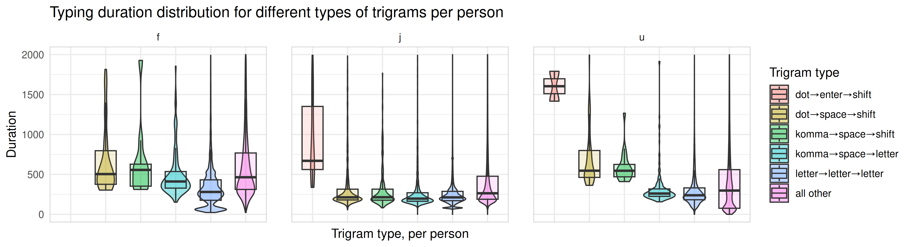

# Neo N-Gram Duration Logger

`neo_ngram_duration_logger.py` is a Python script that records the timing between keystrokes to measure **bigram** (pairs of keys) and **trigram** (triplets of keys) durations.  
It is designed for research/analysis of typing behavior and theorized "thinking pauses" while preserving privacy by **shuffling rows and durations** before saving.

---

## Features
- Logs key press intervals (bigram and trigram durations).
- Automatically saves results into CSV files.
- Periodically flushes data to disk (every 10 seconds).
- Shuffles rows and durations to prevent reconstruction of typed text.
- Merges multiple runs into combined summary files (`bigrams_all.csv`, `trigrams_all.csv`).
- Exit shortcut, because CTRL+C doesn't work on Windows: **CTRL → SHIFT → ESC**. Press them in that order.

---

## Installation
Clone the repository and install dependencies:

```bash
git clone https://github.com/Glitchy-Tozier/neo_ngram_duration_logger.git
cd neo_ngram_duration_logger
pip install pynput
```

## Usage

Run the script:

```bash
python neo_ngram_duration_logger.py --output-dir ./neo_ngram_durations
```

- `--output-dir` (optional): directory to store log files (default: ./neo_ngram_durations).
- `--no-console-logging` (optional): Useful if you don't want to show the actual characters console (for privacy reasons).
- Stop the logger by pressing **CTRL → SHIFT → ESC.**

## Output

- Individual run files:
  - `bigrams_YYMMDD_HHMMSS.csv`
  - `trigrams_YYMMDD_HHMMSS.csv`
- Combined files (aggregated across runs, **ONLY SHARE THESE FILES**):
  - `bigrams_all.csv`
  - `trigrams_all.csv`

Each row contains an n-gram and a shuffled list of durations (milliseconds), for example:

```csv
bigram,durations
th,"[120.5, 134.2, 128.9]"
he,"[98.7, 110.3]"
```

# Scrambling your data

Should you plan to upload your ngram data somewhere, I suggest running `data_preparation.qmd` before doing so. This further anonymizes / poisons your data, without distorting analysis in any meaningful way.

If you do not plan on uploading your data to a public repository, you can ignore this step and continue onwards to `Data Analysis`.

# Data Analysis

Instead, you can directly run `data_evaluation.qmd`. To do so, I recommend installing the R programming language and RStudio, then opening the file in that code editor.

Example output:


